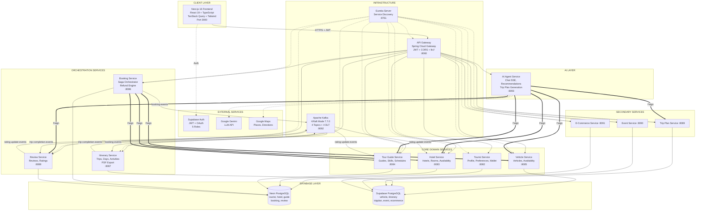

# Travel Plan Platform - System Architecture

> AI-Powered Travel Planning Platform for Sri Lanka Tourism

## Tech Stack

| Layer | Technology |
|---|---|
| **Frontend** | Next.js 16, React 19, TypeScript, Tailwind CSS 4, TanStack Query |
| **Backend** | Java 21, Spring Boot 3.5.0, Spring Cloud 2025.0.0 |
| **Gateway** | Spring Cloud Gateway (Reactive) |
| **Discovery** | Netflix Eureka |
| **Messaging** | Apache Kafka 7.7.0 (KRaft mode) |
| **Auth** | Supabase Auth (JWT) |
| **Databases** | PostgreSQL (Neon + Supabase) |
| **AI** | Google Gemini API, LangChain4j, Google ADK 0.5.0 |
| **Containers** | Docker Compose |

## Architecture Diagram



## Microservice Registry

| # | Service | Port | Database | Role |
|---|---|---|---|---|
| 1 | **Discovery Server** | 8761 | - | Eureka service registry |
| 2 | **API Gateway** | 8060 | - | Request routing, JWT validation, CORS |
| 3 | **Tourist Service** | 8082 | Neon (tourist_db) | Tourist profiles, preferences, wallet |
| 4 | **Hotel Service** | 8083 | Neon (hotel_db) | Hotel CRUD, rooms, availability, search |
| 5 | **Tour Guide Service** | 8084 | Neon (guide_db) | Guide profiles, skills, schedules |
| 6 | **Vehicle Service** | 8085 | Supabase (vehicle) | Vehicle management & availability |
| 7 | **Booking Service** | 8086 | Neon (booking_db) | Multi-provider booking with saga pattern |
| 8 | **Itinerary Service** | 8087 | Supabase (itinerary) | Trip planning, PDF export, scheduling |
| 9 | **Review Service** | 8088 | Neon (review_db) | Reviews, ratings, provider responses |
| 10 | **Trip Plan Service** | 8089 | Supabase (tripplan) | Trip templates & packages |
| 11 | **Event Service** | 8090 | Supabase (event) | Travel events |
| 12 | **E-Commerce Service** | 8091 | Supabase (ecommerce) | Products & orders |
| 13 | **AI Agent Service** | 8093 | - | AI chat, recommendations, trip generation |

## Kafka Event Flows

```
Booking Service ──[booking-events]──> Itinerary Service
                ──[booking-notifications]──> (Future: Notification Service)

Itinerary Service ──[trip-completion-events]──> Review Service

Review Service ──[rating-update-events]──> Hotel Service
                                        ──> Tour Guide Service
```

Each topic has 3 partitions and a corresponding `.DLT` (Dead Letter Topic) for failed messages.

## Inter-Service Communication

### Synchronous (Feign Clients)
- **Booking Service** -> Hotel, Tour Guide, Vehicle (availability checks + saga confirmations)
- **AI Agent Service** -> Hotel, Tour Guide, Vehicle, Review, Trip Plan (search & recommendations)

### Asynchronous (Kafka)
- **booking-events**: Booking lifecycle events (created, confirmed, cancelled, refund)
- **trip-completion-events**: Daily scheduled job detects completed trips
- **rating-update-events**: New reviews trigger rating recalculation in provider services

## Authentication & Authorization

| Role | Access |
|---|---|
| `TOURIST` | Browse, book, review, AI chat, manage profile |
| `HOTEL_OWNER` | Manage hotels/rooms, view bookings, respond to reviews |
| `TOUR_GUIDE` | Manage guide profile, availability, respond to reviews |
| `VEHICLE_OWNER` | Manage vehicles, view bookings |
| `ADMIN` | Full system access |

## Frontend Routes

| Route | Auth | Role | Purpose |
|---|---|---|---|
| `/login`, `/register` | Public | - | Authentication |
| `/hotels`, `/guides` | Public | - | Browse providers |
| `/profile` | Protected | TOURIST | Profile management |
| `/bookings` | Protected | TOURIST | View/manage bookings |
| `/chat` | Protected | TOURIST | AI travel assistant |
| `/reviews` | Protected | TOURIST | Submit/view reviews |
| `/provider/dashboard` | Protected | Provider | Provider analytics |
| `/provider/hotels` | Protected | HOTEL_OWNER | Hotel management |
| `/provider/bookings` | Protected | Provider | Incoming bookings |

## Running Locally

```bash
# Start infrastructure
cd backend
docker compose up kafka kafka-init kafka-ui discovery-server api-gateway -d

# Start services (pick what you need)
docker compose up tourist-service hotel-service booking-service -d

# Frontend
cd ../frontend
npm run dev

# Kafka UI: http://localhost:8080
# Eureka:   http://localhost:8761
# Gateway:  http://localhost:8060
# Frontend: http://localhost:3000
```
